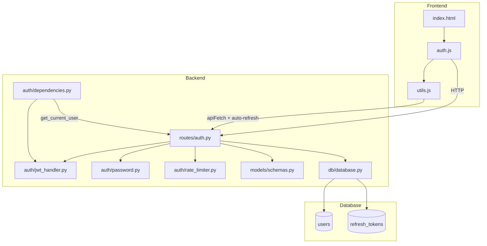
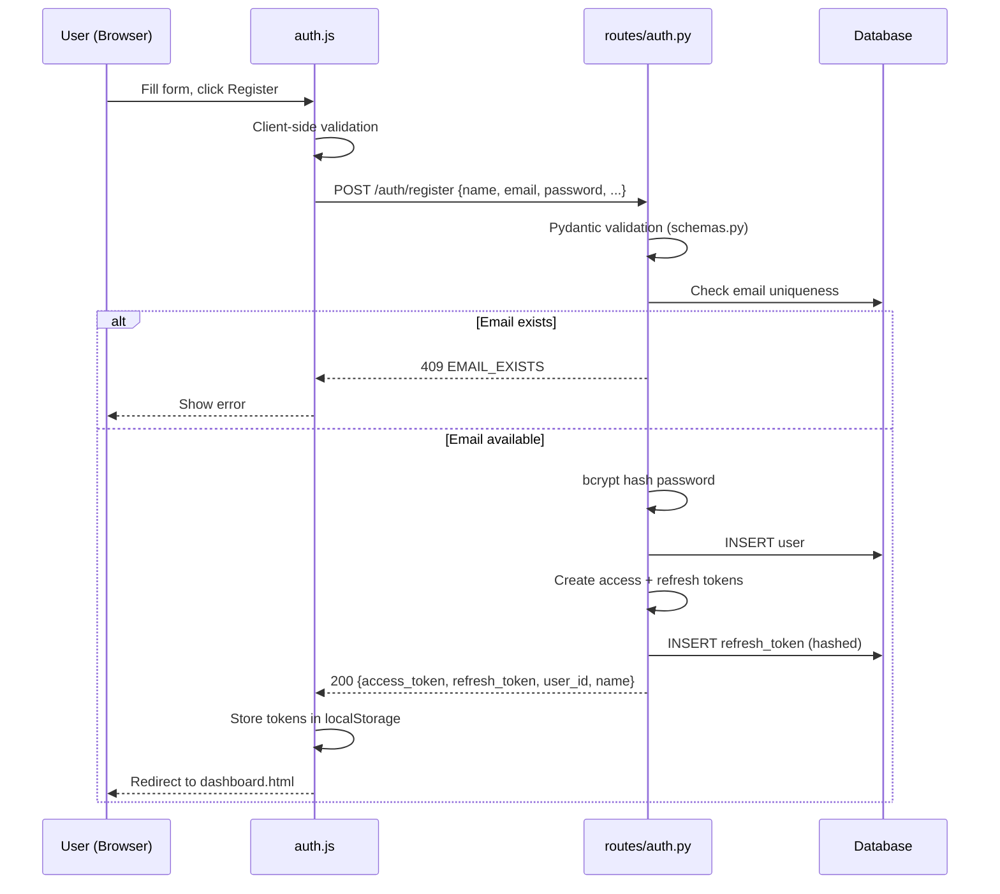
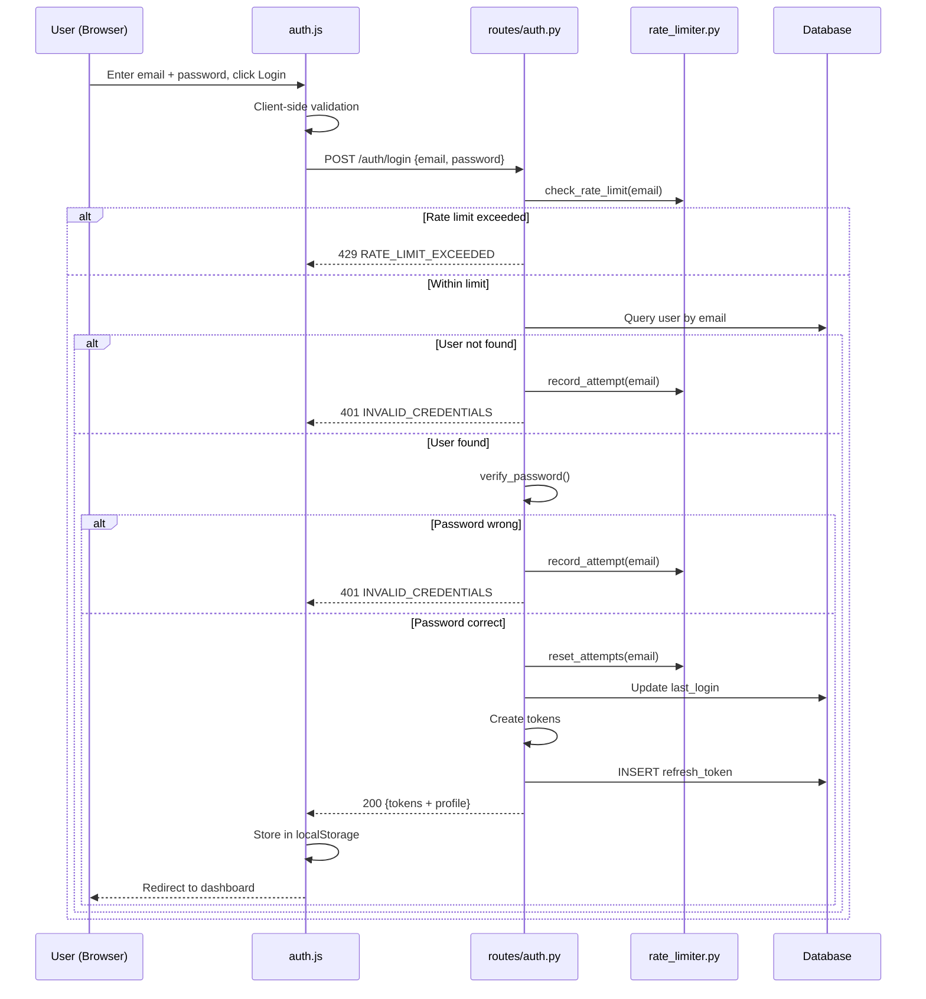
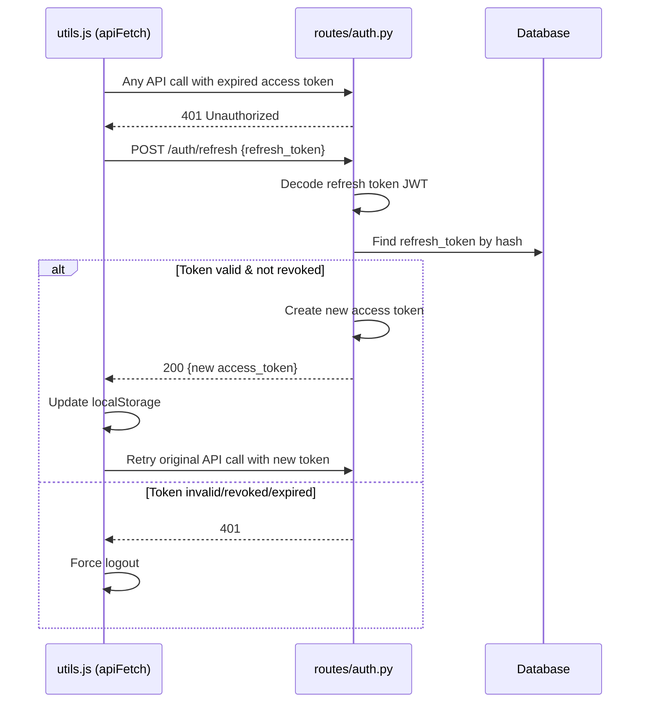

# F1 — Authentication & User Management: Technical Plan

> **Feature ID**: F1  
> **Status**: ✅ Implemented  
> **Last Updated**: 2026-05-05

---

## 1. Architecture Overview



---

## 2. Component Design

### 2.1 Backend Components

#### `routes/auth.py` — Auth Router
- **Pattern**: FastAPI `APIRouter` with 6 endpoints.
- **Error Handling**: Uses `create_error_response()` helper to return consistent JSON errors (not HTTPException), so the frontend always receives a parseable JSON body.
- **Token Flow**: On register/login → create access + refresh tokens → hash refresh token → store hash in `refresh_tokens` table → return both tokens in response.

#### `auth/jwt_handler.py` — JWT Token Manager
- **Library**: `python-jose` (JOSE implementation).
- **Token Structure**:
  - `sub`: user_id as string
  - `type`: "access" or "refresh"
  - `iat`: issued-at timestamp
  - `exp`: expiration timestamp
- **Config**: All parameters driven by environment variables with sensible defaults.

#### `auth/password.py` — Password Hasher
- **Library**: `bcrypt`.
- **Salt Rounds**: 10 (balance of security and performance).
- **Pattern**: Standalone utility functions, no class state.

#### `auth/rate_limiter.py` — Login Rate Limiter
- **Pattern**: In-memory sliding window using `defaultdict(list)` of timestamps.
- **Thread Safety**: `threading.Lock` protects all read/write operations.
- **Cleanup**: Old attempts pruned on every `check_rate_limit()` / `record_attempt()` call.
- **Limitation**: Not persistent across server restarts; not suitable for multi-instance deployment.

#### `auth/dependencies.py` — Auth Dependency
- **Pattern**: FastAPI dependency using `HTTPBearer` security scheme.
- **Flow**: Extract token from `Authorization` header → decode → query user by ID → return `User` ORM object.
- **Usage**: `current_user: User = Depends(get_current_user)` on any protected endpoint.

#### `models/schemas.py` — Pydantic Validation
- **Pattern**: Field-level validators using `@field_validator` decorators.
- **Validators**: Email normalization, password complexity, gender enum, diet_pref enum, language enum, terms acceptance.

### 2.2 Frontend Components

#### `index.html` — Login/Register Page
- **Layout**: Centered auth card with gradient background, tab-switching UI.
- **Forms**: Two forms (login/register), only one visible at a time.
- **Styling**: Custom radio buttons for diet preference, inline error display.

#### `auth.js` — Auth Logic
- **Dual Validation**: Client-side validation mirrors server-side rules for instant feedback.
- **Token Storage**: `localStorage` for `access_token`, `refresh_token`, `user_name`, `user_id`.
- **Redirect**: Auto-redirect to dashboard if token exists on page load.
- **Keyboard**: Enter key submits whichever form is visible.

#### `utils.js` — Shared Auth Infrastructure
- **`apiFetch()`**: Wrapper around `fetch()` that auto-attaches Bearer token, and on 401 → attempts token refresh → retries original request → if refresh fails → force logout.
- **`requireAuth()`**: Guard function called on every protected page; redirects to login if no token.
- **`logout()`**: Calls `/auth/logout` → clears `localStorage` → redirects to login.
- **Idle Timer**: 30-minute timeout, reset on any user interaction event.

---

## 3. File Map

```
backend/
├── auth/
│   ├── __init__.py
│   ├── dependencies.py      # get_current_user FastAPI dependency
│   ├── jwt_handler.py        # create/decode JWT tokens
│   ├── password.py            # bcrypt hash/verify
│   └── rate_limiter.py        # in-memory sliding window limiter
├── models/
│   └── schemas.py             # Pydantic request models
├── routes/
│   └── auth.py                # /auth/* endpoints
└── db/
    └── database.py            # User, RefreshToken ORM models

frontend/
├── index.html                 # Login/Register page
├── js/
│   ├── auth.js                # Login/Register handlers
│   └── utils.js               # apiFetch, requireAuth, logout, idle timer
└── css/
    └── style.css              # Shared design system
```

---

## 4. Data Flow Diagrams

### 4.1 Registration Flow


### 4.2 Login Flow


### 4.3 Token Refresh Flow


---

## 5. Design Decisions

| Decision | Choice | Rationale |
|----------|--------|-----------|
| Token storage | `localStorage` | Simple for SPA; acceptable risk for health info app (not banking) |
| Error responses | JSON (not HTTPException) | Ensures frontend always gets parseable response body |
| Rate limiter | In-memory | Sufficient for single-instance deployment; no external dependency |
| Password rules | 4-rule validation | Balance of security and user friction for a health app |
| Email normalization | `.lower()` on both registration and login | Prevents case-mismatch login failures |
| Allergies storage | JSON string in Text column | Flexible for varying list lengths; avoids separate table complexity |
| Refresh token hashing | SHA-256 | Fast, deterministic; sufficient for token lookup (bcrypt too slow for lookups) |

---

## 6. Dependencies

### Backend
| Package | Version | Purpose |
|---------|---------|---------|
| `fastapi` | latest | Web framework |
| `python-jose[cryptography]` | latest | JWT encode/decode |
| `bcrypt` | latest | Password hashing |
| `pydantic[email-validator]` | latest | Request validation |
| `sqlalchemy` | latest | ORM |

### Frontend
| Dependency | Type | Purpose |
|------------|------|---------|
| None | — | Pure vanilla JS, no framework |

---

## 7. Environment Variables

| Variable | Default | Required | Description |
|----------|---------|----------|-------------|
| `JWT_SECRET_KEY` | `"your-secret-key"` | ✅ Yes (production) | Secret for signing JWTs |
| `JWT_ALGORITHM` | `"HS256"` | No | JWT signing algorithm |
| `JWT_ACCESS_EXPIRE_MINUTES` | `1440` (24h) | No | Access token lifetime |
| `JWT_REFRESH_EXPIRE_DAYS` | `7` | No | Refresh token lifetime |

---

## 8. Known Limitations & Future Improvements

| Limitation | Impact | Potential Fix |
|------------|--------|---------------|
| Rate limiter is in-memory | Resets on server restart; doesn't work across multiple instances | Redis-backed rate limiter |
| No email verification | Users can register with any email | Add email verification flow |
| No password reset | Users locked out if they forget password | Add forgot-password with email OTP |
| No OAuth/social login | Users must create password-based accounts | Add Google/GitHub OAuth |
| Allergies not validated | Free-text array, no standard allergy codes | Use standardized allergy taxonomy |
| No account deletion | GDPR compliance gap | Add `DELETE /auth/account` endpoint |
