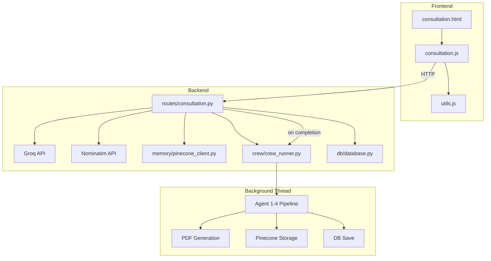
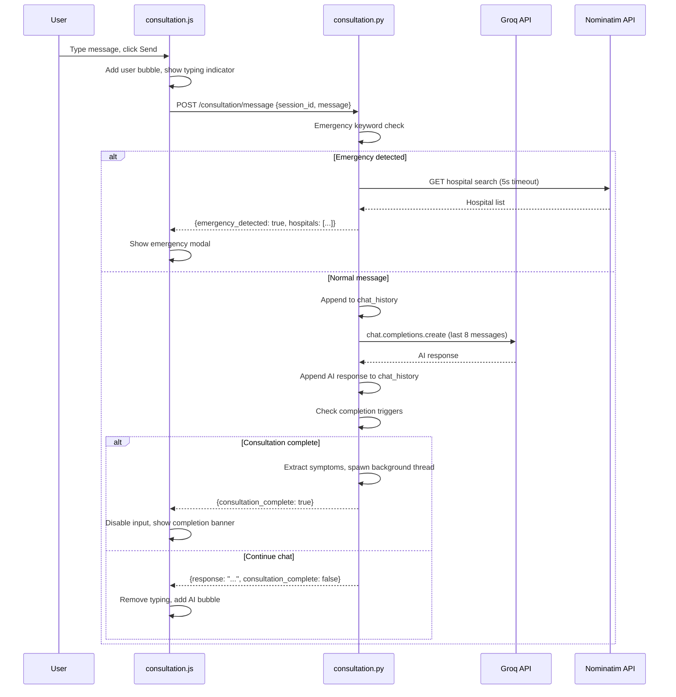

# F2 — AI Consultation (Chat): Technical Plan

> **Feature ID**: F2  
> **Status**: ✅ Implemented  
> **Last Updated**: 2026-05-05

---

## 1. Architecture Overview



---

## 2. Component Design

### 2.1 In-Memory Session Store
- **Pattern**: Module-level Python dictionary `sessions = {}` keyed by session_id.
- **Lifecycle**: Created at `/start`, mutated at each `/message`, consumed by report endpoints, no expiration/cleanup mechanism.
- **Contents**: Full patient profile dict with ~35 keys including chat_history, symptoms, diagnosis results, etc.
- **Tradeoff**: Fast access but volatile — lost on server restart. DB serves as persistent fallback.

### 2.2 Groq Direct Chat (Not CrewAI)
- **Rationale**: CrewAI agent execution takes 30-60+ seconds per run. For real-time chat, Groq API is called directly via the `groq` Python SDK for sub-second responses.
- **System Prompt**: Carefully crafted to prevent the AI from diagnosing or suggesting medicines — it only collects information.
- **Context Window**: Last 8 messages (sliding window) to keep token usage low while maintaining conversation coherence.
- **Fallback**: On Groq API error, returns a generic follow-up question so the chat doesn't break.

### 2.3 Emergency Detection
- **Pattern**: Simple keyword matching (not AI-based) for speed and reliability.
- **Language Coverage**: English (11 keywords), Hindi (4 keywords), Marathi (3 keywords).
- **Hospital Finder**: Nominatim OpenStreetMap API with 5-second timeout. Returns up to 3 hospitals with Google Maps links.
- **Isolation**: Emergency detection runs BEFORE the AI response, ensuring instant alerts.

### 2.4 Completion Detection
- **Dual Trigger**: Phrase-based ("that's all", "done", etc.) OR message count (≥5 user messages).
- **Background Pipeline**: Uses `threading.Thread(daemon=True)` to run the full 4-agent crew without blocking the HTTP response.
- **Pipeline Thread**: Creates its own SQLAlchemy session (`SessionLocal()`) since DB sessions aren't thread-safe.

### 2.5 Session Reconstruction
- **Scenario**: If a message arrives for a session_id not in memory (e.g., after server restart), the system reconstructs the session from the DB `consultations` table + `users` table.
- **Limitation**: Chat history is lost on reconstruction — only structured data (symptoms, status) survives.

---

## 3. File Map

```
backend/
├── routes/
│   └── consultation.py        # /consultation/* endpoints, session store, Groq chat, emergency detection
├── crew/
│   └── crew_runner.py         # run_full_crew() called in background thread
├── memory/
│   └── pinecone_client.py     # get_patient_memory() called at session start
└── db/
    └── database.py            # Consultation model

frontend/
├── consultation.html          # Chat UI layout
└── js/
    └── consultation.js        # Chat logic, typing indicator, emergency modal
```

---

## 4. Data Flow

### Message Processing Flow


---

## 5. Design Decisions

| Decision | Choice | Rationale |
|----------|--------|-----------|
| Real-time chat engine | Groq direct API (not CrewAI) | CrewAI takes 30-60s; Groq responds in <2s |
| Session storage | In-memory dict | Fast; DB is fallback for persistence |
| Emergency detection | Keyword matching (not AI) | Instant, deterministic, no API latency |
| Completion trigger | Phrases + message count ≥5 | Catches both explicit and implicit completion |
| Pipeline execution | Background daemon thread | User gets immediate response; pipeline runs async |
| Context window | Last 8 messages | Balances context quality with token cost |
| Chat model | `llama-3.3-70b-versatile` | Best quality available on Groq free tier |

---

## 6. Known Limitations

| Limitation | Impact | Potential Fix |
|------------|--------|---------------|
| In-memory sessions lost on restart | Active consultations break | Redis/persistent session store |
| No WebSocket support | Polling required for pipeline status | Add WebSocket for real-time updates |
| Chat history lost on reconstruction | Context lost after restart | Store chat_history in DB |
| 5-message auto-complete | May trigger too early for complex cases | Make threshold configurable or AI-determined |
| Single-thread pipeline | Only one pipeline per session | Already correct; thread pool for scale |
| No message rate limiting | User could spam messages | Add per-session rate limiting |
