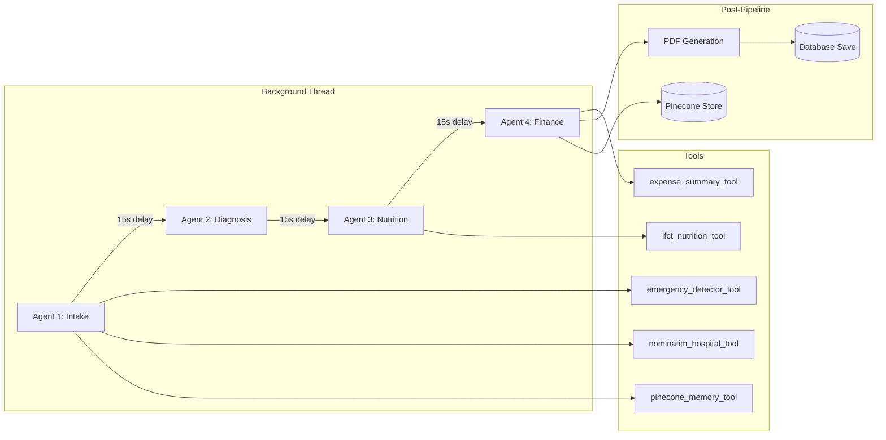

# F3 — Multi-Agent AI Pipeline (CrewAI): Technical Plan

> **Feature ID**: F3  
> **Status**: ✅ Implemented  
> **Last Updated**: 2026-05-05

---

## 1. Architecture Overview



---

## 2. Component Design

### 2.1 Agent Definitions (`agents/`)
- Each agent defined using `crewai.Agent` with role, goal, backstory, LLM config, and tools.
- Each file exports: the agent instance, a `create_agentX_task()` function, and a `parse_X_output()` function.
- Parse functions strip markdown fences (`\`\`\`json ... \`\`\``) before `json.loads()`, with robust defaults on failure.

### 2.2 Crew Runner (`crew/crew_runner.py`)
- **`run_full_crew()`**: Main orchestrator. Runs agents in 3 separate Crew executions (not one 4-agent crew) to manage rate limits:
  1. Crew 1: Agent 1 + Agent 2 (diagnosis)
  2. 15s sleep
  3. Crew 2: Agent 3 (nutrition)
  4. 15s sleep
  5. Crew 3: Agent 4 (finance)
  6. PDF generation
  7. DB save + Pinecone store
- **`run_intake_crew()`**: Agent 1 only (used for standalone intake).
- **`run_diagnosis_crew()`**: Agent 1 + 2 (used for diagnosis only).
- **`run_nutrition_only()`**: Agent 3 only (used for standalone nutrition).

### 2.3 Pinecone Client (`memory/pinecone_client.py`)
- **Embedding**: HuggingFace Inference API (`all-MiniLM-L6-v2`) → 384-dimensional vectors.
- **Storage**: Upsert with session_id as vector ID, metadata includes user_id + summary text.
- **Retrieval**: Query by embedding of "patient {user_id} health history", filter by user_id, top_k=3.
- **Fail-safe**: All Pinecone operations wrapped in try/except — app never crashes if Pinecone is down.

### 2.4 IFCT Nutrition Data (`data/ifct_nutrition.json`)
- Local 21KB JSON file with Indian food items.
- Fields per item: food_name, food_name_hindi, per_100g (iron_mg, protein_g, vitamin_c_mg, calories_kcal).
- Lookup: case-insensitive substring match on food_name or food_name_hindi.

---

## 3. File Map

```
backend/
├── agents/
│   ├── __init__.py
│   ├── agent1_intake.py        # Agent 1 + tools (emergency, hospital, memory)
│   ├── agent2_diagnosis.py     # Agent 2 + parse_diagnosis_output()
│   ├── agent3_nutrition.py     # Agent 3 + ifct_nutrition_tool + parse
│   └── agent4_finance.py       # Agent 4 + expense_summary_tool + parse
├── crew/
│   ├── __init__.py
│   └── crew_runner.py          # Orchestrator: run_full_crew, save_to_db, save_to_pinecone
├── memory/
│   ├── __init__.py
│   └── pinecone_client.py      # embed(), get_patient_memory(), store_session_summary()
└── data/
    └── ifct_nutrition.json     # IFCT 2017 food composition dataset
```

---

## 4. Design Decisions

| Decision | Choice | Rationale |
|----------|--------|-----------|
| 3 separate Crews (not 1 crew of 4 agents) | Separate Crew executions | Rate limit management; isolates failures |
| 15-second delays between crews | `time.sleep(15)` | Groq free tier rate limit (~30 req/min) |
| Background thread (not async/Celery) | `threading.Thread(daemon=True)` | Simple; no external queue dependency |
| IFCT data as local JSON | File-based lookup | No external API dependency; fast; small dataset |
| HuggingFace for embeddings (not OpenAI) | Free inference API | Zero cost; acceptable quality for medical summaries |
| Pinecone for vector memory | Managed vector DB | Free tier available; simple API; persistent |

---

## 5. Error Handling Strategy

| Component | Failure Mode | Handling |
|-----------|-------------|----------|
| Agent 1 output parsing | Invalid JSON | Keep existing profile data unchanged |
| Agent 2 output parsing | Invalid JSON | Return default diagnosis (empty conditions, severity=mild, see_doctor=true) |
| Agent 3 output parsing | Invalid JSON | Return empty meal_plan and deficiencies |
| Agent 4 output parsing | Invalid JSON | Return monthly_total=0, empty breakdown |
| Groq API | Rate limit / timeout | Agent crew fails; pipeline continues with defaults |
| Pinecone | Connection error | Log error, skip memory operations |
| HuggingFace | Model cold start | 60s timeout; return empty embedding |
| PDF generation | Any error | Log error; pdf_path remains None |
| DB save | Any error | Rollback transaction; log error |

---

## 6. Known Limitations

| Limitation | Impact | Potential Fix |
|------------|--------|---------------|
| Sequential execution (~2-3 min total) | User waits for full report | Parallel agent execution where possible |
| Groq free tier rate limits | 15s delays needed between crews | Upgrade to paid tier or use multiple API keys |
| Agent 4 uses raw SQLite (not SQLAlchemy) | Won't work with PostgreSQL in production | Refactor to use SQLAlchemy query |
| No retry logic on agent failures | Single attempt per agent | Add retry with exponential backoff |
| IFCT dataset is small (~21KB) | Limited food coverage | Expand dataset or use nutrition API |
| Embeddings via HuggingFace free API | Cold starts cause 30s+ delays | Self-host embedding model or use paid API |
