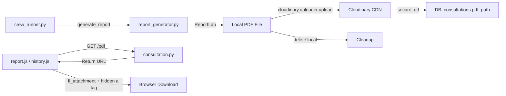

# F5 — PDF Report Generation & Cloud Storage: Technical Plan

> **Feature ID**: F5  
> **Status**: ✅ Implemented  
> **Last Updated**: 2026-05-05

---

## 1. Architecture



---

## 2. File Map

```
backend/
├── pdf/
│   ├── __init__.py
│   └── report_generator.py    # generate_report() — ReportLab + Cloudinary upload
├── pdfs/                       # Temp local storage (cleaned after upload)
└── routes/
    └── consultation.py         # GET /report/{id}/pdf endpoint

frontend/js/
├── report.js                   # downloadPDF() for report page
└── history.js                  # downloadPDF() for history page
```

---

## 3. PDF Generation Flow

1. `run_full_crew()` calls `generate_report(patient_profile)` after all agents complete.
2. `generate_report()` creates local PDF using ReportLab with custom styles and colors.
3. PDF is uploaded to Cloudinary: `cloudinary.uploader.upload(path, resource_type="image", folder="swasthyaai_reports/")`.
4. Cloudinary returns `secure_url` → stored as `pdf_path` in patient profile and DB.
5. Local file is deleted to save disk space.

---

## 4. Frontend Download Strategy

The download logic handles 3 scenarios:

```
downloadPDF(pdfUrl):
  1. If pdfUrl starts with "http" (Cloudinary URL):
     → Insert "fl_attachment" into URL path (after /upload/)
     → Create hidden <a> tag with download attribute
     → Programmatic click → remove <a>
  
  2. If no pdfUrl available:
     → Call GET /consultation/report/{id}/pdf
     → If response JSON has "url" field → apply step 1
     → If response is binary → create blob URL → download
  
  3. Fallback:
     → window.open(url, '_blank')
```

### `fl_attachment` URL Transformation
```
Before: https://res.cloudinary.com/xxx/image/upload/v123/folder/file.pdf
After:  https://res.cloudinary.com/xxx/image/upload/fl_attachment/v123/folder/file.pdf
```

---

## 5. Design Decisions

| Decision | Choice | Rationale |
|----------|--------|-----------|
| `resource_type="image"` (not "raw") | Cloudinary config | Allows transformation flags like `fl_attachment` |
| `fl_attachment` flag | Cloudinary transformation | Forces browser to download instead of preview |
| Hidden `<a>` tag (not `window.open`) | DOM injection | Bypasses browser PDF viewer popup issues |
| Delete local after upload | Disk cleanup | Server doesn't accumulate PDFs; Cloudinary is source of truth |
| ReportLab (not wkhtmltopdf/Puppeteer) | Pure Python | No external binary dependencies; works on all hosts |

---

## 6. Known Limitations

| Limitation | Potential Fix |
|------------|---------------|
| Old reports may have non-`fl_attachment` URLs | Batch migration script for `pdf_path` column |
| Local PDF briefly exists before upload | Acceptable; auto-cleaned |
| No PDF password protection | Add encryption via ReportLab |
| PDF layout is basic (no charts/graphs) | Add matplotlib chart generation |
