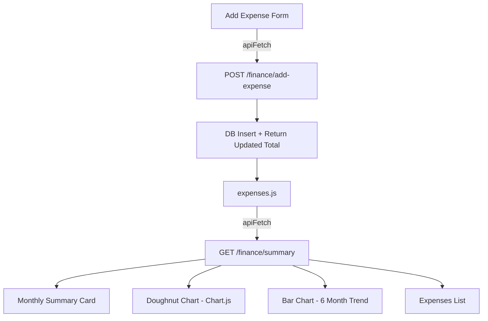

# F7 — Medical Expense Tracker: Technical Plan

> **Feature ID**: F7  
> **Status**: ✅ Implemented  
> **Last Updated**: 2026-05-05

---

## 1. File Map

```
backend/
├── routes/finance.py            # POST /add-expense, GET /summary
├── agents/agent4_finance.py     # AI agent (runs in F3 pipeline)
├── models/schemas.py            # ExpenseRequest Pydantic model
└── db/database.py               # Expense ORM model

frontend/
├── expenses.html                # Expense page layout
└── js/expenses.js               # Load data, render charts, handle form
```

---

## 2. Architecture



---

## 3. Backend Design

### Monthly Aggregation
- Uses SQLAlchemy `func.sum()` with date filters for current and previous month.
- Category breakdown via `GROUP BY category`.
- 6-month trend via loop: for each of last 6 months, query sum between month boundaries.

### Month Boundary Calculation
- `get_month_back(dt, months_back)` handles year rollover (e.g., Jan - 1 month = Dec previous year).
- First day of current month used as boundary.

### Savings Source
- Pulled from latest completed consultation's `savings_estimate` field (set by Agent 4).
- Returns 0 if no consultations exist.

---

## 4. Frontend Design

### Charts (Chart.js)
- **Doughnut Chart**: 5-category breakdown with colors: blue, orange, green, red, purple.
- **Bar Chart**: 6-month trend; filters out months with zero data; rounded corners on bars.
- Both charts are destroyed before re-rendering to prevent memory leaks.

### Expense Form
- Toggle-able form (hidden by default, shown via button click).
- Fields: date (default today), category dropdown, amount input, description textarea.
- On save: POST to API → hide form → reload all data.

### Expense List
- Rendered from breakdown object (not individual records).
- Shows category name + monthly total per category.
- Empty state with "Log your first medical expense" prompt.

---

## 5. Design Decisions

| Decision | Choice | Rationale |
|----------|--------|-----------|
| Category-based summary (not individual records) | Aggregated view | More actionable than raw transaction list |
| Savings from latest consultation only | Single source | Agent 4 recalculates each time |
| Chart.js doughnut (not pie) | Cleaner look with center hole | Modern aesthetic |
| 6-month trend window | Fixed lookback | Covers recent history without overload |

---

## 6. Known Limitations

| Limitation | Potential Fix |
|------------|---------------|
| No individual expense edit/delete | Add PATCH/DELETE endpoints |
| No expense receipt upload | Add file upload with Cloudinary |
| Savings formula is simplistic | More sophisticated financial modeling |
| No budget setting or alerts | Add budget feature with notifications |
| Bar chart skips zero-months | May confuse timeline; show all months with 0 |
