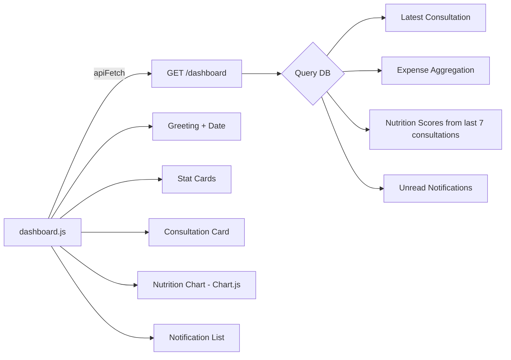

# F8 — Dashboard: Technical Plan

> **Feature ID**: F8  
> **Status**: ✅ Implemented  
> **Last Updated**: 2026-05-05

---

## 1. File Map

```
backend/
├── routes/dashboard.py          # GET /dashboard — aggregation endpoint
└── db/database.py               # Consultation, Expense, Notification models

frontend/
├── dashboard.html               # Dashboard layout
└── js/dashboard.js              # Load data, render chart + cards + notifications
```

---

## 2. Architecture



---

## 3. Backend Aggregation Logic

The `/dashboard` endpoint performs 4 queries in a single request:

1. **Latest Consultation**: `ORDER BY session_date DESC LIMIT 1` → extract primary condition from JSON, calculate follow-up days by severity.
2. **Expenses**: Two `func.sum()` queries — current month and previous month — to compute total and change %.
3. **Nutrition Scores**: Last 7 consultations → parse `deficiencies` JSON → calculate iron fulfillment % → pad to 7 data points.
4. **Notifications**: `WHERE is_read = 0 ORDER BY created_at DESC LIMIT 5` + auto-generated follow-up if `see_doctor = true`.

### Error Handling
- Entire endpoint wrapped in try/except → returns safe defaults on any failure (empty arrays, zero values).

---

## 4. Frontend Design

### Layout
- Top bar with user avatar (first letter), greeting, date.
- Two stat cards: Nutrition Score + Monthly Expenses.
- Latest consultation card with condition badge, severity, "View Full Report" button.
- Nutrition trend chart (Chart.js line, 7 data points).
- Notifications/reminders list with icons per type (👨‍⚕️ follow-up, 💊 refill, 🔔 general).
- Bottom navigation bar.

### Empty States
- No consultations: "Start your first consultation" prompt.
- No notifications: "You're all caught up! ✅" message.
- API error: "Unable to load data. Retry" link.

---

## 5. Design Decisions

| Decision | Choice | Rationale |
|----------|--------|-----------|
| Single aggregation endpoint | One `GET /dashboard` call | Minimizes HTTP requests; simpler frontend |
| Auto-generated follow-up notifications | Computed on the fly | No cron job needed; always up-to-date |
| 7-point nutrition chart | Fixed window | Consistent chart size |
| Severity-based follow-up days | mild=7, moderate=3, severe=1 | Clinical best practice approximation |

---

## 6. Known Limitations

| Limitation | Potential Fix |
|------------|---------------|
| Notifications only auto-generated (no persistence) | Create notifications from pipeline post-processing |
| No notification dismiss/mark-read from UI | Add mark-read API endpoint + UI button |
| Dashboard loads all data even if user only wants to navigate | Lazy loading or tabbed sections |
| No profile editing from dashboard | Add quick-edit link to profile page |
