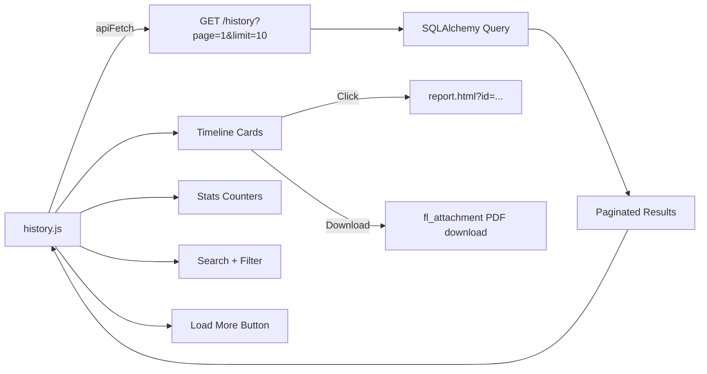

# F9 — Consultation History: Technical Plan

> **Feature ID**: F9  
> **Status**: ✅ Implemented  
> **Last Updated**: 2026-05-05

---

## 1. File Map

```
backend/
└── routes/history.py            # GET /history, GET /history/analytics/*

frontend/
├── history.html                 # History page layout (timeline only, no trends)
└── js/history.js                # Load data, render timeline, search, filter, pagination
```

---

## 2. Architecture



---

## 3. Backend Design

### Pagination
- Server-side `offset/limit` pagination via SQLAlchemy `query.offset().limit()`.
- Returns `total` count and `total_pages` for client-side pagination controls.

### Filtering
- **date_from / date_to**: Server-side `WHERE session_date >= / <=` filters.
- **condition**: Client-side post-filter after fetching results (searches `primary_condition` by substring).

### Primary Condition Extraction
- Each consultation's `conditions` column is a JSON string.
- Parsed at query time → extract `conditions[0].name` → defaults to "Unknown" if empty/invalid.

---

## 4. Frontend Design

### Timeline Cards
Each card rendered by `renderTimeline()` with:
- Date (formatted as "May 05, 2026")
- Primary condition name
- Severity badge (color-coded: green/yellow/red)
- Status badge (completed/in_progress)
- PDF download icon (if `pdf_available`)
- Click handler → navigate to report page

### Stats Counters
Three counters above the timeline:
- Total consultations
- Completed count
- Follow-up pending count (derived from severity being "moderate" or "severe")

### Search & Filter
- Text search input: filters `allConsultations` array by condition name (client-side).
- Status dropdown: All, Completed, In Progress, Follow-Up Pending (client-side filter).
- Both filters call `applyFilters()` which re-renders the timeline.

### Pagination
- "Load More" button visible when `currentPage < totalPages`.
- Clicking appends next page's results to existing `allConsultations` array.
- `loadHistory(reset=false)` mode for appending vs `reset=true` for fresh load.

---

## 5. Design Decisions

| Decision | Choice | Rationale |
|----------|--------|-----------|
| Server-side pagination, client-side condition filter | Hybrid approach | Pagination needed for scale; condition filter is fast on small result sets |
| Timeline-only (no trends) | Trends tab removed per user request | Simplified, focused UI |
| Stats derived from loaded data | No separate API call | Avoids extra request; accurate for displayed subset |
| "Load More" (not page numbers) | Mobile-friendly pattern | Better UX on mobile; simpler implementation |

---

## 6. Known Limitations

| Limitation | Potential Fix |
|------------|---------------|
| Analytics endpoints return stub data | Implement real aggregation queries |
| Client-side condition filter only works on loaded pages | Move to server-side filter |
| No date range picker UI | Add date inputs wired to `date_from`/`date_to` params |
| Stats only reflect loaded pages, not total | Separate stats endpoint or include in pagination response |
| Follow-up pending is derived heuristic | Add explicit `follow_up_status` column |
